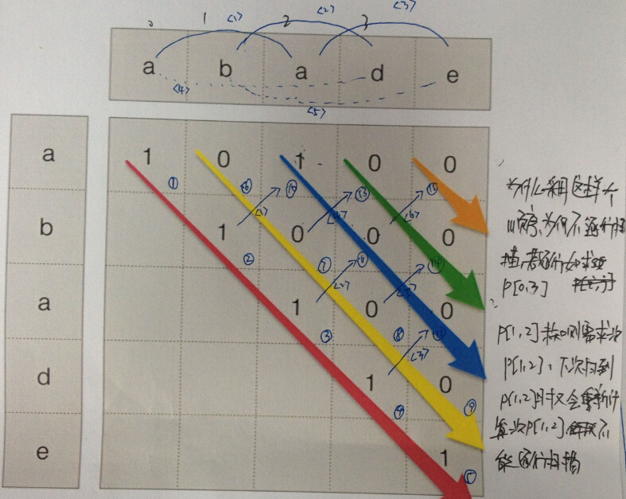

###**Num 005**: _Longest Palindromic Substring_
 
####**DP(Dynamic Programming):**
1. [num005_dp.cpp](https://github.com/lxw0109/LeetCode_lxw/blob/master/LeetCode_CPP%2Fnum005%2Fnum005_dp.cpp) 
 Idea: Expressed in the following picture. 
 *  
2. [num005_dp_MLE.cpp](https://github.com/lxw0109/LeetCode_lxw/blob/master/LeetCode_CPP%2Fnum005%2Fnum005_dp_MLE.cpp) 
 Memory Limit Exceeded. Heap memory.
3. [num005_dp_TLE.cpp](https://github.com/lxw0109/LeetCode_lxw/blob/master/LeetCode_CPP/num005/num005_dp_TLE.cpp) 
 Time Limit Exceeded. Saving the MaxStr temporarily with **"string"** costs too much time.
  

####**string:**
1. [num005_string.cpp](https://github.com/lxw0109/LeetCode_lxw/blob/master/LeetCode_CPP%2Fnum005%2Fnum005_string.cpp) 
